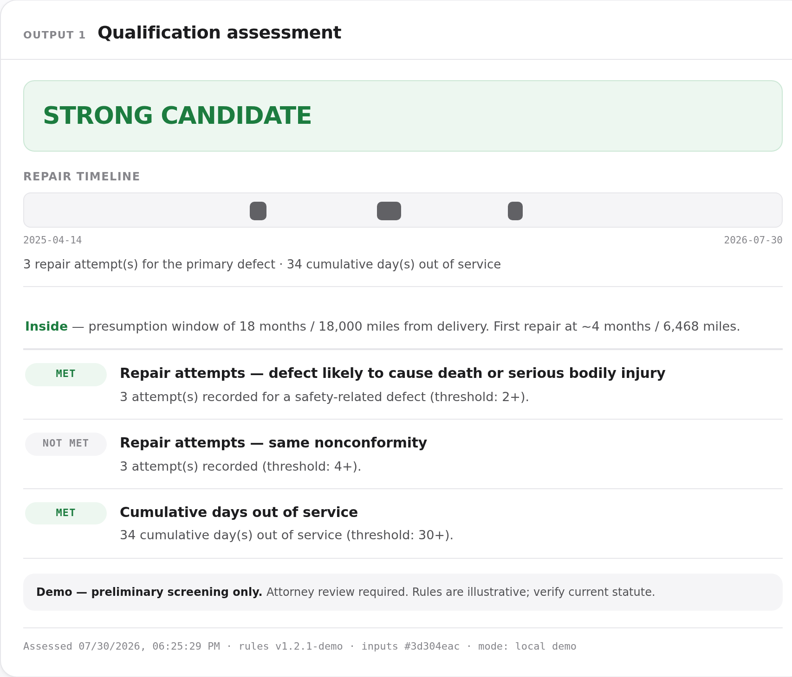
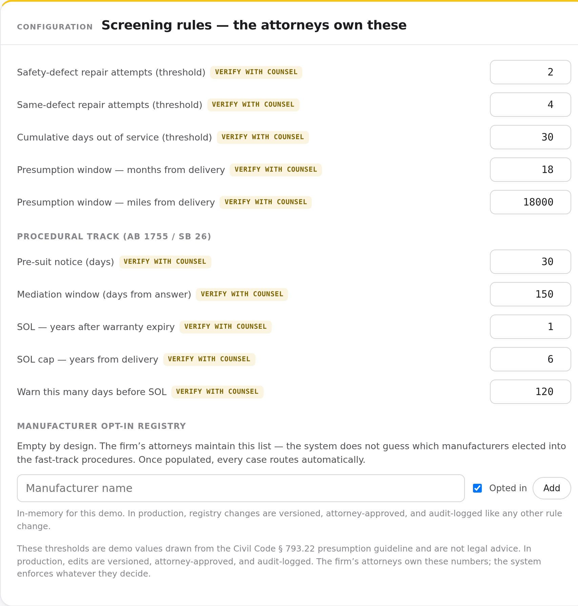
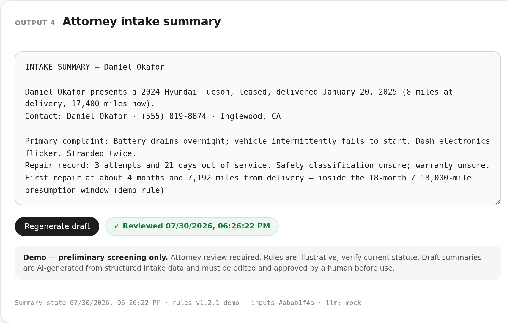

© Andre C. Demonstration only — all rights reserved. Not licensed for use, reproduction, or deployment. Production licensing: andre@ciasca.com.

# Lemon Law Intake Qualifier — v2 (Demo)

**Live demo:** [tech49it.github.io/lemon-qualifier](https://tech49it.github.io/lemon-qualifier/) · or open `index.html` in a browser. No build step, no backend, no dependencies, zero network beyond web fonts.

A working demonstration of a **document-first** intake pipeline for a California lemon law practice. v1 started at the intake form. v2 starts where the firm's actual pain starts: the stack of dealership repair orders — then carries every downstream output forward from v1.4.

Built by Andre C ([github.com/tech49it](https://github.com/tech49it)) as a technical demonstration. **Everything in it is demo logic with fictional data. Nothing here is legal advice.**

## What's new in v2

**Stage 01 — Repair order extraction.** Three fictional RO facsimiles process visibly: each field gets highlighter-swept as it lands in the extraction ledger with a confidence score. Low-confidence fields and document anomalies are **flagged for human verification, never silently accepted**. The demo catches, on screen:

- **"Could not duplicate / no fault found"** language — counted as a customer-reported repair attempt and flagged for counsel, because dealership wording should not erase an attempt.
- **Date conflicts** — an invoice date that disagrees with the date-out is queued for verification rather than picked arbitrarily.
- **Overlapping out-of-service days** — ranges across dealers are merged so no day counts twice; the days-out math shows the naive sum, the overlap removed, and the merged total.

In production this stage is a server-side OCR + LLM pipeline ingesting real scanned PDFs and phone photos. The demo renders embedded facsimiles so it runs offline and exposes no backend logic.

**Provenance typography.** Monospace (IBM Plex Mono) = machine-read off a document. Serif (Source Serif 4) = attorney-facing memo prose. Sans (Libre Franklin) = interface. A reviewer can tell at a glance where every value came from. System fallbacks keep the demo presentable when fonts are blocked or offline.

**Pure engine, decomposed.** The single-file v2 was refactored into the repo's multi-file layout, and every screening function moved to `js/engine.js` — zero DOM, zero network, same inputs same verdict. The days-out figure now comes from the range-merge de-duplication, not a naive sum.

## Everything downstream — inherited from v1.4 and carried forward

- **A signal band at the top** — verdict, value tier, estimated net exposure, and civil-penalty factor count, each a chip that jumps to the panel behind it.
- **The attorneys own the rules.** Every threshold lives in one editable config (`js/rules.js`), tagged "verify with counsel," shipped with illustrative values drawn from the Civ. Code § 1793.22 presumption guideline. Editing bumps the rule version and stamps every output.
- **Output 5 — Case value & priority (screening view).** Repurchase exposure = price − a statutory-style mileage offset (Civ. Code § 1793.2(d)(2)(C) denominator, demo value); a configurable review floor separates likely full-buyback candidates from "small case → attorney review"; civil-penalty posture surfaces factors as present/absent and **never estimates an amount** (willfulness is a legal determination); fictional comparable outcomes are context, never a predicted result. It triages; it never values.
- **Human-in-the-loop, everywhere it matters.** The attorney summary is a draft until a person marks it reviewed — and if any case data, rule, or checklist item changes afterward, the review is **revoked automatically**. A governed pipeline (draft → pending → approved) gates consultation booking in logic, not just UI.
- **The AB 1755 / SB 26 procedural layer.** Track routing against a manufacturer opt-in roster that **ships empty on purpose** (no verified public roster exists), deadline arithmetic that names which attorney-configured rule controlled, and post-*Rodriguez v. FCA US LLC* (Cal. 2024) screening for used vehicles that asks a question rather than deciding coverage.
- **Missing-document request drafts** that regenerate from the checklist, never state whether the case qualifies, and leave the panel only via copy-to-clipboard. Nothing transmits.
- **Audit trail on every output.** Timestamp, rule version, and an input hash on every event.

## Case-management fit

The outputs are shaped to drop into whatever case-management system the firm already runs. The audit line (timestamp · rule version · input hash) is the record every event carries; the comparables screen is a stand-in for a query against the firm's own resolved matters (`js/closedCases.js` is fictional and labeled as such — production draws on the firm's real closed cases); every client-facing draft is copy-only, so a human decides what, if anything, enters the system of record. There is no bundled third-party integration in this demo, and none is faked.

## v1 → v2 changelog

- **Added** Stage 01 repair-order extraction: facsimile documents, highlighter-sweep animation (respects `prefers-reduced-motion`), extraction ledger with per-field confidence, and flags for CND language, invoice/date-out conflicts, and overlapping out-of-service days.
- **Added** provenance typography (mono = machine-read, serif = attorney prose, sans = interface).
- **Refactored** the pure screening functions out of `js/rules.js` into a new `js/engine.js`; `rules.js` is now config-only. `app.js` is UI only.
- **Changed** cumulative days out of service to use range-merge de-duplication (`daysOutOfService`) — the assessment now shows naive sum − overlap = merged total.
- **Added** RO facsimile fields (`ro`, `invoice`, `conf`) to the three sample cases, authored to keep every v1.4 figure intact (Rivera stays STRONG / FULL BUYBACK CANDIDATE, merged days out = 34, net exposure = $55,725 on the default rules).
- **Added** `test/engine.test.js` (39 assertions) alongside the retained v1.4 suite; a permanent statute-citation regression guard.
- **Preserved** unchanged: the signal band, Output 5 value screen, procedural track, governed review pipeline, booking, audit log, and all legal/disclaimer copy.

## Architecture

```
index.html            shell markup + <link>/<script> tags (plain scripts, in order)
css/styles.css        design system + Stage 01 styles; provenance font tokens
js/rules.js           RULES_CONFIG — the object the attorneys own (data only)
js/engine.js          pure engine — evaluateCase, estimateValue, daysOutOfService,
                      docFlags, resolveTrack, computeDeadlines, buildTimeline, …
                      (zero DOM, zero network; runs identically in Node)
js/sampleCases.js     three fictional cases (+ RO facsimile fields) + blank template
js/closedCases.js     FICTIONAL closed-case sample + findComparables()
js/llm.js             summary + document-request generator: mock (default) + live seam
js/workflow.js        governed-intake lifecycle, approval guard, audit log, booking
js/app.js             UI state and rendering only — no business logic
test/engine.test.js   39 assertions against the pure engine (node test/engine.test.js)
test/rules.test.js    v1.4 behavior-parity suite (node test/rules.test.js)
```

**Business logic never touches the DOM.** `evaluateCase()`, `daysOutOfService()`, `docFlags()`, `estimateValue()`, and `computeDeadlines()` are pure functions — same inputs, same verdict — and run identically in Node for testing.

Script load order (plain `<script>` tags, no bundler): `rules → engine → sampleCases → closedCases → llm → workflow → app`.

## Running the tests

No package.json, no dependencies — just Node:

```
node test/engine.test.js     # 39 assertions: extraction flags, day-merge, verdicts,
                             # value screen, roster, determinism, statute regression
node test/rules.test.js      # v1.4 behavior-parity suite
```

## Screenshots

_Screenshots are captured from the live site after deploy — placeholders below are **TODO**._

**Stage 01 — repair-order extraction** — a facsimile RO highlighter-swept field by field into the extraction ledger, with confidence scores and the CND / date-conflict / overlap flags.

 <!-- TODO: capture from live site -->

**Qualification assessment** — the verdict, the repair timeline, and the criteria ledger with a plain-English reason on every line.

 <!-- TODO: recapture for v2 -->

**The rules belong to the attorneys** — every threshold editable and tagged "verify with counsel," and the manufacturer opt-in registry ships empty by design.

 <!-- TODO: recapture for v2 -->

**Attorney intake summary** — a 30-second read that names the swing factor and open items, held behind a human-review gate.

 <!-- TODO: recapture for v2 -->

## Data handling in production

- All extraction, prompt chains, and rules evaluation run server-side on infrastructure the firm controls. No model keys, prompts, or business logic ship client-side.
- LLM calls use zero-retention API terms; client documents are not used for model training.
- PII/VIN redaction available at ingestion; append-only audit log retained per firm policy.

## Honesty notes

- All names, vehicles, dealers, VINs, and records are fictional. VINs are deliberately not valid 17-character VINs.
- Thresholds reference the Song-Beverly Consumer Warranty Act, Civ. Code § 1793.2 et seq., and the Tanner Consumer Protection Act presumption, Civ. Code § 1793.22, as illustrative starting points requiring attorney validation. The app says so on every output.
- The AB 1755 / SB 26 procedural-track intervals are demo values; public sources disagreed on the pre-suit notice operative date (April 1 vs July 1, 2025) — which is why they are editable configuration, not constants.
- Day-counting and attempt-grouping conventions are simplifications marked for counsel review. A non-presumption path under § 1793.2(d) remains available outside the Tanner window. *Rodriguez v. FCA US LLC* (Cal. 2024) screening asks a question; it does not decide coverage.
